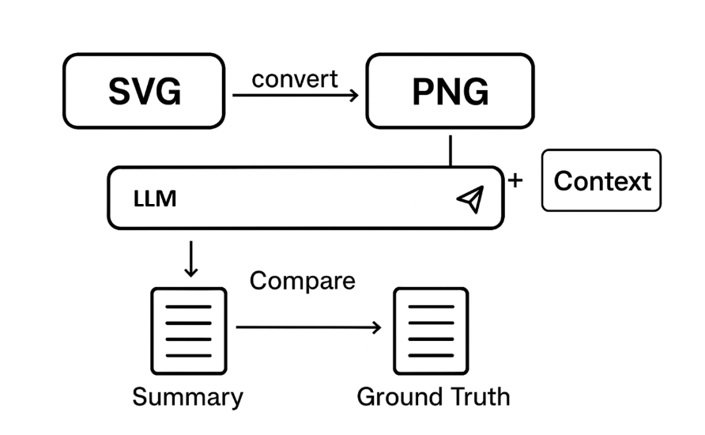

# Evaluation -- logic:

### summary generation using gemini:

`python generate_summary.py [model name that used to gen diagram] [gemini api key]`

### utilize embedding model and its average result:
[embedding_summary.ipynb](embedding_summary.ipynb)

more details about this embedding model: 
[embedding](https://huggingface.co/McGill-NLP/LLM2Vec-Meta-Llama-3-8B-Instruct-mntp-supervised)

### utilize reranking model and its average result:

[similarity.ipynb](similarity.ipynb)

more details about this reranker model: 
[reranker](https://huggingface.co/BAAI/bge-reranker-v2-minicpm-layerwise)

